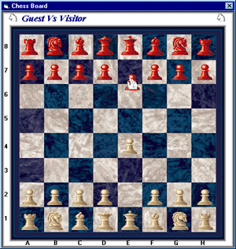



## Internet Chess Game

### Description

This a great chess game playable over the net, ther you will find a good exemple of what is

an internet Game data transfer, i use an OCX as the ChessBoard. The code is littlebit

spagetti but its been a while from this creation, the most important is to learn, there is also

a chat window and you connect by IP MUST SEE !!.

Please visit my new web site and see what you can do VB power !!!come and chat with me http://www.virtualgamer.t2u.com
 
### More Info
 
The only parameter required is the ChessBoard.ocx file and i included with the package.

if you which to have this code (ChessBoard.ocx) (Use of: BitBlt TranparentBlt ...COOL !!)

Just Email me at elterrorista@videotron.ca, with of course something good to say :)

Thanks for Using this code.

This return a pretty good knowledge.

             |
---                |---
**Submitted On**   |1999-08-11 18:37:02
**By**             |[HarveySolutions](https://github.com/Planet-Source-Code/PSCIndex/blob/master/ByAuthor/harveysolutions.md)
**Level**          |Intermediate
**User Rating**    |6.0 (620 globes from 104 users)
**Compatibility**  |VB 5\.0, VB 6\.0
**Category**       |[Internet/ HTML](https://github.com/Planet-Source-Code/PSCIndex/blob/master/ByCategory/internet-html__1-34.md)
**World**          |[Visual Basic](https://github.com/Planet-Source-Code/PSCIndex/blob/master/ByWorld/visual-basic.md)
**Archive File**   |[CODE\_UPLOAD339\.zip](https://github.com/Planet-Source-Code/harveysolutions-internet-chess-game__1-2910/archive/master.zip)

